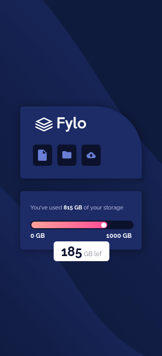

# Frontend Mentor - Solución a fylo data storage

Esta es una solución al [Desafío del componente fylo data storage en Frontend Mentor](https://www.frontendmentor.io/challenges/fylo-data-storage-component-1dZPRbV5n).

## Tabla de contenido

- [Visión general](#visión-general)
  - [El reto](#el-reto)
  - [Capturas de pantalla](#capturas-de-pantalla)
  - [Enlaces](#enlaces)
- [Mi proceso](#mi-proceso)
  - [Construido con](#construción)
  - [Lo que aprendi](#lo-que-aprendi)
  - [Desarrollo continuo](#desarrollo-continuo)
  - [Recursos útiles](#recursos-útiles)
- [Autor](#autor)

## Visión general

### El reto

Los usuarios deben ser capaces de:

- Ver el diseño óptimo en función del tamaño de la pantalla de su dispositivo
- Ver los estados hover de los elementos interactivos

### Capturas de pantalla

- Escritorio


- Móvil



### Enlaces

- URL de la solución (Frontend Mentor): [Solución en Frontend Mentor](https://www.frontendmentor.io/solutions/flexbox-gridlayout-responsivedesign-clippath-queries-mF1seRtWS0).
- URL del sitio en vivo: [En vivo](https://boudgnosis.github.io/fylo-data-storage-component/)

## Mi Proceso

### Construción

- HTML semántico
- Variables CSS
- Flexbox
- GRID
- Accesibilidad web
- Media queries 
- Responsive desing
- clip-path

### Lo que aprendi

Aprendi a crear formas basicas con **clip-path**.

```css
.container .box__text {
	clip-path: polygon(0 0, 100% 0%, 100% 51%, 100% 90%, 80% 65%, 0 65%);
}
```

### Desarrollo continuo

Me costó bastante poder conseguir la forma de la caja de texto flotante y me gusto bastante este pequeño reto porque
no conocia este recurso de CSS que planeo investigar aun más.

### Recursos útiles

- [MDN Web Docs](https://developer.mozilla.org/es/) - Suelo usar este recurso porque explica muy bien todo además de que tiene una documentación muy amplia.
- [Bennettfeely](https://bennettfeely.com/clippy/) - Buena aplicación para ayudarte a crear formas con clip-path.
-[MDN - polygon()](https://developer.mozilla.org/en-US/docs/Web/CSS/basic-shape/polygon) - Una sección de MDN que explica bastante bien el valor **polygon**.
- [ENIUN](https://www.eniun.com/gradientes-css-lineal-radial/) - Explica como usar los gradientes con ejemplos en codepen.

## Autor

- Codepen - [@boudgnosis](https://codepen.io/boudgnosis)
- Frontend Mentor - [@boudgnosis](https://www.frontendmentor.io/profile/boudgnosis)
- Twitter - [@juan_ariasd](https://twitter.com/juan_ariasd)   
- Dev - [@juan_duque](https://dev.to/juan_duque)
- Linkedink - [juan pablo arias duque](https://www.linkedin.com/in/jpariasduque/)
